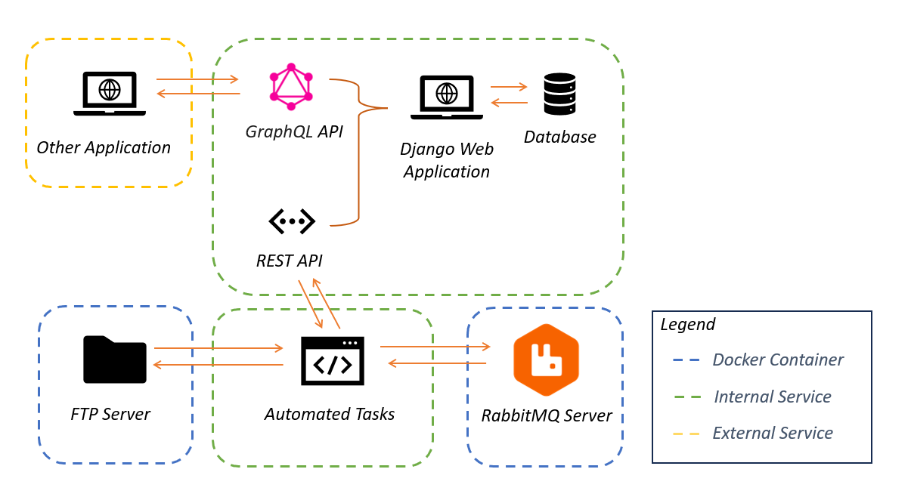

- [1. Technical Showcase Project](#1-technical-showcase-project)
  - [1.1. Desirable Skills](#11-desirable-skills)
- [2. Project Structure](#2-project-structure)
  - [2.1. Components](#21-components)
  - [2.2. Legend](#22-legend)
  - [2.3. Project Components](#23-project-components)

# 1. Technical Showcase Project

This project demonstrates a wide range of technical skills including, but not only:

- **Relational and NoSQL databases**
- **Stored Procedures, Views, Functions, and Triggers**
- **Manipulation of files via FTP (reading and writing)**
- **Handling of positional files**
- **Creation and maintenance of REST and GraphQL services** (synchronous and asynchronous)
- **Unit and integration testing**
- **Communication protocols with JSON and XML**

## 1.1. Desirable Skills
- Implementation of solutions following OWASP recommendations (to avoid SQL injection, CORS, XSS, etc.)
- Integration of systems using the FIX protocol
- Use of Design Patterns and SOLID principles
- Integration of systems via messaging/service bus/sockets (pub/sub)
- Interpretation of execution plans (table scan, hash/index scan)
- Execution of calls to SOAP services
- Experience with JAVA (algorithmic trading)

---

# 2. Project Structure

This project is composed of multiple interconnected components, each serving a specific purpose in the overall architecture. The diagram below illustrates the structure and interaction between these components:

## 2.1. Components

1. **FTP Server**
   - Simulates an FTP server for financial services using Docker.
   - Handles file uploads and downloads for automated tasks.

2. **RabbitMQ Server**
   - Acts as a message broker for communication between producers and consumers.
   - Routes and queues requests based on data type (JSON, XML, or CSV).

3. **Automated Tasks**
   - Processes files retrieved from the FTP server.
   - Sends task execution requests to RabbitMQ for queuing and consumption.

4. **Django Web Application**
   - Provides REST and GraphQL APIs for managing and consuming FTP data.
   - Interacts with the database to store and retrieve processed information.

5. **Other Applications**
   - External applications can interact with the system via GraphQL APIs.

## 2.2. Legend

- **Docker Container:** Represents services running in isolated Docker containers for this demo purposes (e.g., FTP Server, RabbitMQ Server).
- **Internal Service:** Represents backend services like the Django application and automated tasks.
- **External Service:** Represents external applications interacting with the system.

This modular architecture ensures scalability, separation of concerns, and ease of integration between components.

## 2.3. Project Components

This project consists of multiple components. Detailed instructions for running each component can be found in the specific README file for that component.

| Component                           | Description                                           | README Link                                                                 |
|-------------------------------------|-------------------------------------------------------|-----------------------------------------------------------------------------|
| RabbitMQ Server Application         | Docker setup to run the RabbitMQ services (pub/sub).          | [RabbitMQ Server README](financial-rabbitmq/README.md)              |
| FTP Server Application              | Docker setup to emulate an FTP server for financial services. | [FTP Server README](financial-ftp-app/README.md)                    |
| Django FTP Consumer Application     | Django app that consumes data from the FTP server via REST APIs. | [Django App README](app/README.md)                               |
| Automated Tasks Producer            | Script to fetch data from the Django Rest API and send message to RabbitMQ | [Producer Script README](tasks\producer\README.md)     |

---

Feel free to explore each component to see the technical skills demonstrated in this project.